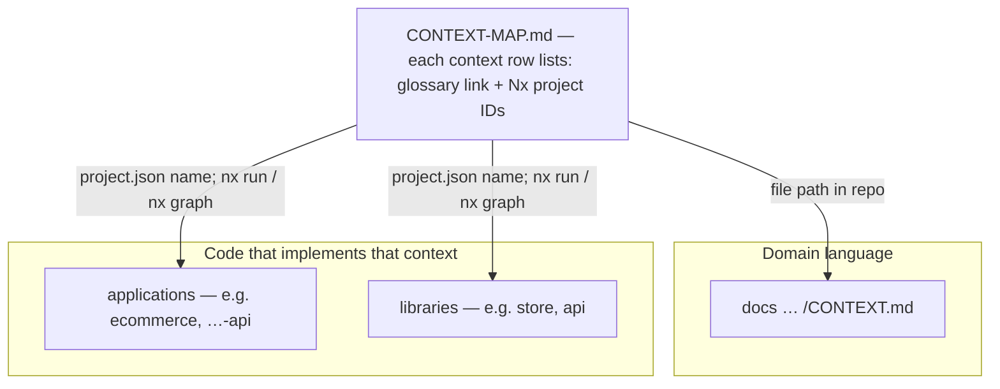

<what-to-do>

Interview me relentlessly about every aspect of this plan until we reach a shared understanding. Walk down each branch of the design tree, resolving dependencies between decisions one-by-one. For each question, provide your recommended answer.

Ask the questions one at a time, waiting for feedback on each question before continuing.

If a question can be answered by exploring the codebase, explore the codebase instead.

</what-to-do>

<supporting-info>

## Domain awareness

During codebase exploration, also look for existing documentation. Start from the repo root: if `CONTEXT-MAP.md` exists, use it to locate the right `CONTEXT.md` for the topic.

### File structure

Most repos have a single context:

```
/
├── CONTEXT.md
├── docs/
│   └── adr/
│       ├── 0001-event-sourced-orders.md
│       └── 0002-postgres-for-write-model.md
└── src/
```

If a `CONTEXT-MAP.md` exists at the root, the repo has multiple contexts. The map points to where each one lives:

```
/
├── CONTEXT-MAP.md                    ← one row per context: link + Nx project IDs
├── docs/
│   ├── adr/                          ← workspace-wide ADRs
│   └── <area>/
│       ├── CONTEXT.md
│       ├── …                         ← db, API docs, etc.
│       └── adr/                      ← optional context-scoped ADRs
├── apps/
│   └── <app-name>/                   ← Nx: project id often matches folder
└── libs/
    └── <lib-name>/
```

**Nx monorepos:** Prefer `CONTEXT-MAP.md` at the workspace root and one `CONTEXT.md` per domain area under `docs/<area>/` (e.g. `docs/ecommerce/CONTEXT.md`), next to other domain docs like schema notes.

In `CONTEXT-MAP.md`, for **each** context row, record the **Nx project IDs** that carry that domain: the `name` field from each relevant `project.json` / `package.json` (the same strings you use in `nx run <name>:<target>`, `nx graph`, and task inputs). That list is the link between “this glossary” and “this code”—folder names alone are not enough because roots can be renamed while project IDs stay stable. Optionally split the column into applications vs libraries when it gets long. Do not bury glossaries under `apps/<app>/src` unless a context is truly owned by a single app.

Nx layout in the repo (how the map, language file, and Nx graph line up):



```
/
├── CONTEXT-MAP.md                    ← one row per context: link + Nx project IDs
├── docs/
│   ├── adr/                          ← workspace-wide ADRs
│   └── <area>/
│       ├── CONTEXT.md
│       ├── …                         ← db, API docs, etc.
│       └── adr/                      ← optional context-scoped ADRs
├── apps/
│   └── <app-name>/                   ← Nx: project id often matches folder
└── libs/
    └── <lib-name>/
```

Create files lazily — only when you have something to write. If no `CONTEXT.md` exists, create one when the first term is resolved. If no `docs/adr/` exists, create it when the first ADR is needed.

**Which `CONTEXT.md` to edit:** If `CONTEXT-MAP.md` exists, read it first and open the linked file for the topic at hand. If the topic spans contexts, update each affected `CONTEXT.md` or add a relationship row to `CONTEXT-MAP.md` when boundaries become clear.

## During the session

### Challenge against the glossary

When the user uses a term that conflicts with the existing language in the relevant `CONTEXT.md` (use `CONTEXT-MAP.md` at the repo root when present), call it out immediately. "Your glossary defines 'cancellation' as X, but you seem to mean Y — which is it?"

### Sharpen fuzzy language

When the user uses vague or overloaded terms, propose a precise canonical term. "You're saying 'account' — do you mean the Customer or the User? Those are different things."

### Discuss concrete scenarios

When domain relationships are being discussed, stress-test them with specific scenarios. Invent scenarios that probe edge cases and force the user to be precise about the boundaries between concepts.

### Cross-reference with code

When the user states how something works, check whether the code agrees. If you find a contradiction, surface it: "Your code cancels entire Orders, but you just said partial cancellation is possible — which is right?"

### Update CONTEXT.md inline

When a term is resolved, update the correct `CONTEXT.md` right there (resolve which file via `CONTEXT-MAP.md` when the repo uses a map). Don't batch these up — capture them as they happen. Use the format in [CONTEXT-FORMAT.md](./CONTEXT-FORMAT.md). If a boundary or relationship between contexts becomes clear, add a line to `CONTEXT-MAP.md` under **Relationships**.

Don't couple `CONTEXT.md` to implementation details. Only include terms that are meaningful to domain experts.

### Offer ADRs sparingly

Only offer to create an ADR when all three are true:

1. **Hard to reverse** — the cost of changing your mind later is meaningful
2. **Surprising without context** — a future reader will wonder "why did they do it this way?"
3. **The result of a real trade-off** — there were genuine alternatives and you picked one for specific reasons

If any of the three is missing, skip the ADR. Use the format in [ADR-FORMAT.md](./ADR-FORMAT.md).

</supporting-info>
