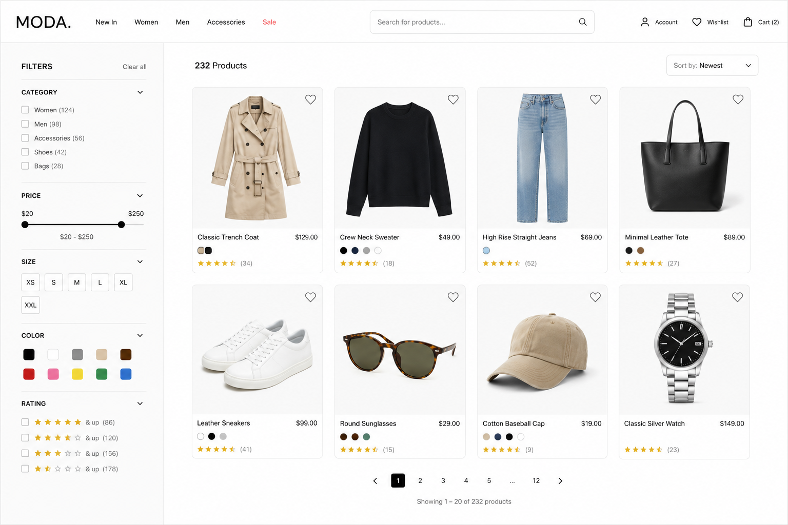

# Ecommerce Catalog Feature Overview

## Overview

The Ecommerce Catalog allows users to browse, search, filter, and paginate through a large collection of products in a clean and intuitive shopping experience.

The feature is designed to help users quickly discover products that match their preferences while maintaining fast navigation and clear product visibility.

---

# User Experience

## Product Browsing

Users can:

- View products in a responsive grid layout
- See essential product information at a glance:

  - Product image
  - Product name
  - Price
  - Rating
  - Available colors or variants

- Add products to wishlist
- Open product details by selecting a product card

---

# Search Functionality

Users can search products using a search bar located at the top of the catalog page.

The search experience allows users to:

- Search by product name
- Quickly narrow down visible products
- Combine search with filters for more accurate results

---

# Filtering System

The catalog includes a sidebar filtering system that helps users refine the product list.

## Available Filters

### Category Filter

Allows users to browse products by category such as:

- Women
- Men
- Accessories
- Shoes
- Bags

### Price Range Filter

Users can define a minimum and maximum price range.

### Size Filter

Allows filtering by available sizes:

- XS
- S
- M
- L
- XL
- XXL

### Color Filter

Users can filter products by available color options.

### Rating Filter

Allows users to display products above a selected rating threshold.

---

# Sorting

Users can sort the catalog based on different criteria.

Examples:

- Newest
- Price: Low to High
- Price: High to Low
- Most Popular
- Highest Rated

---

# Pagination

The catalog supports pagination to improve performance and usability.

Users can:

- Navigate between pages
- Move to next or previous pages
- See the current active page
- Understand how many products are currently displayed
- View the total number of products available

Example:

- Showing 1–20 of 232 products

---

# Responsive Design

The catalog is designed to work across:

- Desktop
- Tablet
- Mobile devices

The layout adapts automatically for smaller screens by:

- Collapsing filters into drawers or modals
- Adjusting product grid columns
- Optimizing spacing and controls for touch devices

---

# Goals of the Feature

The ecommerce catalog aims to:

- Improve product discoverability
- Reduce friction while shopping
- Help users quickly narrow down products
- Provide a modern and visually clean browsing experience
- Support scalable product collections efficiently

---

# Typical User Flow

1. User opens the catalog page
2. User browses visible products
3. User applies filters or search terms
4. Product list updates dynamically
5. User changes sorting or pagination
6. User selects a product to view details
7. User may add products to wishlist or cart
